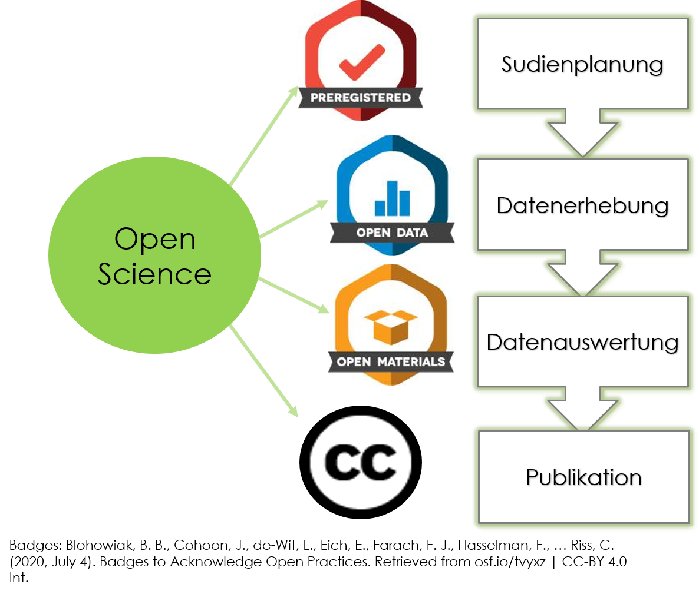
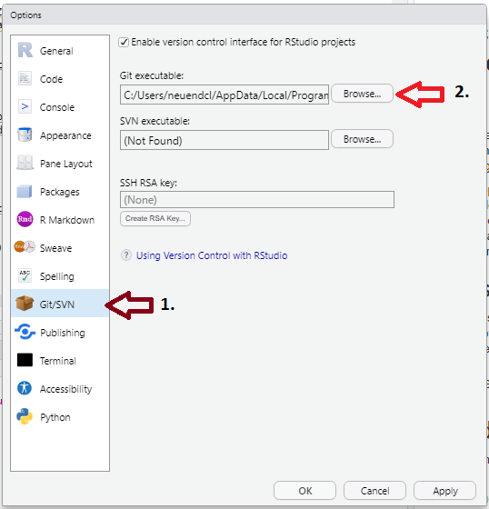

### Was ist eigentlich git?

Git ist ein System zur Versionskontrolle von Dateien. Das heißt, es dokumentiert automatisch Änderungen, die an Files vorgenommen werden und vergleicht unterschiedliche Versionen eines Files. Dabei sollte das File als Textfile darstellbar sein. 

Git kann grundsätzlich von der Kommandozeile aus gesteuert werden. Einfacher ist es aber, einen git-Client zu nutzen. Es gibt viele verfügbare Clients, z.B. RStudio, [smartgit](https://www.syntevo.com/smartgit/) (damit arbeiten wir am FDZ zur Zeit), [gitkraken](https://www.gitkraken.com/) (damit arbeitet das Methodenteam), [sourcetree](https://www.sourcetreeapp.com/) und viele [andere](https://acodez.in/git-gui-clients/) mehr.

### Warum sollte ich mit git arbeiten?

Push Faktoren (negative Anreize)


Pull-Faktoren (positive Anreize)


### Welche Vorbereitungen sind notwendig, wenn ich git mit RStudio nutzen möchte?
1.  Profil auf einem git-Server anlegen

Github ist der wohl bekannteste Server für git-Repositorien. Es gibt allerdings noch weitere und theoretisch könnte auch jede Organisation ihren eigenen git-Server aufsetzen. Dies hat zum Beispiel die Humboldt-Universität gemacht und jeder mit einem HU-Account hat Zugang zum [gitlab-Server der HU](https://scm.cms.hu-berlin.de/).  

Im Workshop werden wir den Umgang mit github zeigen, da die universelle Zugänglichkeit und Bekanntheit sich besonders gut eignet, wenn man Code veröffentlichen oder auch mit anderen an Projekten gemeinsam arbeiten möchte.
Zunächst ist also ein Profil auf [Github](https://github.com) anzulegen. Beim Anlegen des Accounts ist zu beachten, dass dieser Username der Name ist, unter dem ihr und euer Code gefunden werden könnt. Hinweise für die Entscheidung für einen Nutzernamen finden sich auch bei [Jennifer Bryan](https://happygitwithr.com/github-acct.html).

2. git installieren

Um git zu installieren, nutzt folgenden Link: [https://git-scm.com/download/win](https://git-scm.com/download/win). Es ist wichtig, dass ihr euch merkt, bzw. herausbekommt, in welchem Ordner git dann abgelegt ist. Bei mir ist das zum Beispiel: 

> C:/Users/hu-accountname/AppData/Local/Programs/Git/bin

3. R und RStudio installieren

Vermutlich habt ihr R und RStudio bereits auf eurem Computer. Falls nicht, hier die Links: 

* [R](https://ftp.fau.de/cran/) 
* [RStudio] (https://www.rstudio.com/products/rstudio/download/#download)

4. git-Pfad bei R-Studio hinterlegen

Nun müssen wir RStudio mitteilen, wo git gefunden werden kann. Dies geben wir unter Tools --> Global options an.



5. git sagen, wer wir sind

Als nächstes müssen wir git sagen, welches unser username auf Github ist. Das funktioniert am einfachsten direkt in R mit folgendem Code:

```{r eval = F}

## install.packages("usethis")

library(usethis)
use_git_config(user.name = "Username", user.email = "user@iqb.hu-berlin.de")
```

Es ist aber auch möglich, dies direkt in der "Shell" zu tun, mit dem Befehl: 

> git config --global user.name "Username"
> git config --global user.email "user@iqb.hu-berlin.de"

und so könnt ihr prüfen, ob alles funktioniert hat:

> git config --global --list

6. Für den Workshop außerdem vorbereiten:

Öffnet das Beispielrepositorium auf GitHub: [https://github.com/ClaudiaNdf/git_workshop] (https://github.com/ClaudiaNdf/git_workshop)

Erstellt ein neues "Issue", schreibt euren Namen hinein und dass ich euch als Editor aufnehmen soll. 

### Wie sieht der typische Workflow aus?


[Lowndes, 2016](https://jules32.github.io/2016-07-12-Oxford/git/)

### Kleines git-Vokabular

Begiff       | Erklärung
------------ | ------------
Repositorium | Ordner, in dem alle getrackten Files sind, als auch die History der Versionskontrolle
Remote       | Version des Repositoriums, welche auf dem Remote-Server (z.B. GitHub) liegt
Clone       | Eine lokale Kopie eines Repositoriums von einem Remote-Server anlegen
Local       | Version des Repositoriums, die auf einem lokalen Laufwerk gespeichert ist
Stage       | Index der Files, die im nächsten Commit enthalten sein sollen
Commit      | Eine Momentaufnahme der Änderungen, die an den indexierten (staged) Files vorgenommen wurden
Push        | Commits von einem lokalen zu einem remote Repositorium senden
Fork        | Kopie eines anderen Repositoriums (anfertigen), zum Beispiel das komplette Repositorium eines anderen Users
Track       | Ein File, das vom git-Repositorium erkannt wird
Branch      | Eine Parallelversion der Files in einem Repositorium
Merge       | Files updaten, indem Änderungen durch neue Commits eingebaut werden
Pull        | Commits von einem remote Repositorium ziehen und in das lokale Repositorium mergen
Pull request | Lass andere wissen, dass du Änderungen vorgenommen hast.

### Wie funktioniert das in der Praxis mit RStudio?

#### Übungen 

##### Teil 1: Überblick über den Workflow

1. Initialize - Erstellt ein Beispielprojekt auf GitHub 

2. Clone - Spiegelt das Übungsrepositorium auf euren lokalen Rechner

3. Change - Nehmt eine Änderung am Inhalt des Repositoriums vor und speichert diese ab

4. Stage/Commit - Gebt die Änderung in eurer lokales Repositorium

5. Push - Schiebt die Änderungen online nach GitHub 

6. Clean up - Löscht das lokale Repositorium auf eurem Rechner

##### Teil 2: Gemeinsam arbeiten

1. Tretet dem Übungsrepositorium bei (möglichst bereits vor dem Workshop)

2. Clone - Spiegelt das Übungsrepositorium auf euren lokalen Rechner

3. Pull - zieht euch die aktuellste Version
 
4. Change I - erstellt ein neues Textfile mit beliebigem Titel und Inhalt (kein Personenbezug!)

5. Stage/Commit/Push - ladet eure Änderungen in unser gemeinsames Repositorium hoch

6. Change II - Fügt einen Satz in das Dokument `2_6_gemeinsames_dokument.txt`ein.

7. Stage/Commit/Push - ladet eure Änderungen in unser gemeinsames Repositorium hoch

8. Mal sehen, was passiert!

### Tipps und Tricks

* Schreibt Commit-Nachrichten, die euch später helfen, nachzuvollziehen, welcher Stand der Syntax mit diesem Commit vorhanden ist. (Z.B. woran habt ihr heute gearbeitet? Welche Schritte sind jetzt fertig?)

* Wenn ihr unsicher seid, ob alles funktioniert hat, schaut auf dem GitHub-Server nach, ob der Zeitstempel der letzten Änderung mit eurem Zeitstempel übereinstimmt.


### Literatur & Acknowledgements

Der Reader basiert zum Teil auf Inhalten des Workshops "GitFun: Introduction to git and GitHub" von Ana Martinovici. Das Video und die Unterlagen zum Workshop sind abrufbar im [OSF-Projekt] (https://osf.io/zmu3k/).

Eine weitere hilfreiche Ressource rund um git und die Nutzung von git und RStudio ist [Happy Git and GitHub for the useR] (https://happygitwithr.com/) von Jenny Bryan. Aus diesem  

Bryan J. 2017. Excuse me, do you have a moment to talk about version control? PeerJ Preprints 5:e3159v2 https://doi.org/10.7287/peerj.preprints.3159v2 [Titel anhand dieser DOI in Citavi-Projekt übernehmen] 


