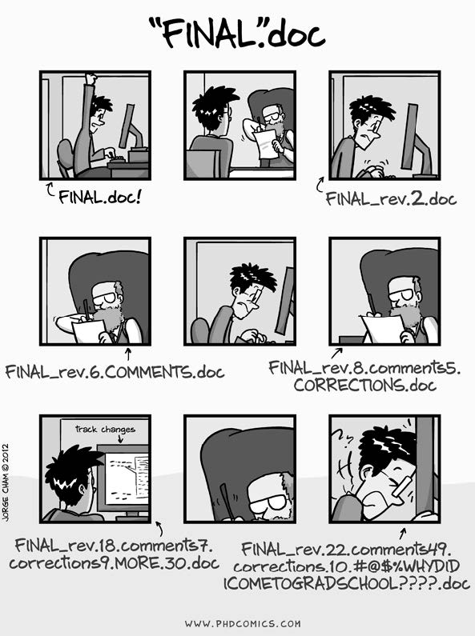

### Was ist eigentlich git?

Git ist ein System zur Versionskontrolle von Dateien. Das heißt, es dokumentiert automatisch Änderungen, die an Files vorgenommen werden und vergleicht unterschiedliche Versionen eines Files. Dabei sollte das File als Textfile darstellbar sein. 

Git kann grundsätzlich von der Kommandozeile aus gesteuert werden. Einfacher ist es aber, einen git-Client zu nutzen. Es gibt viele verfügbare Clients, z.B. RStudio, [smartgit](https://www.syntevo.com/smartgit/) (damit arbeiten wir am FDZ zur Zeit), [gitkraken](https://www.gitkraken.com/) (damit arbeitet das Methodenteam), [sourcetree](https://www.sourcetreeapp.com/) und viele [andere](https://acodez.in/git-gui-clients/) mehr.

### Warum sollte ich mit git arbeiten?

Das Arbeiten mit github lohnt sich sowohl bei Forschungsprojekten, in denen ihr die einzigen seid, die an der Syntax arbeiten, als auch bei Projekten, in denen mehrere parallel an Code arbeiten. Dabei gibt es sowohl "Push Faktoren", die Situationen beschreiben, in denen ihr euch niemals (mehr) befinden möchtet. 



	
Wer kennt nicht das Problem, welches man hat, wenn man nach einer Reviewrunde nochmal an die Analysen muss und nicht mehr weiß, welches denn nun eigentlich der aktuellste Stand war? Oder was eigentlich nochmal der Unterschied zwischen der aktuellen und der Version ist, die man gerade ins Archiv verschoben hat? Oder wenn jemand nach längerer Zeit nachfragt, wie man genau bestimmte Analysen gemacht hat?

	


Noch schlimmer, es könnte passieren, dass ihr aus Versehen Files überschreibt oder löscht und sie dann nicht mehr wiederherstellen könnt, falls ihr kein Backup habt. Was, passiert mit eurem aktuellen Projekt, wenn euer Computer explodiert? 


Github vermeidet nicht nur diese Szenarien, indem es eine Versionshistorie aller Änderungen an Files abspeichert, die ihr jederzeit, von überall aus einsehen und bearbeiten könnt. Es ermöglicht euch auch, auf viel einfachere Art und Weise mit anderen zu kollaborieren und eure Analysen im Sinne von Open Science transparent und für andere verfügbar zu machen. Somit könnt ihr einen zusätzlichen Mehrwert schaffen, wenn andere auf eurer Arbeit aufbauen können und euren Code z.B. weiterverwenden und zitieren.

Wenn ihr zum Beispiel den "Open Materials"-Badge für euer Paper beanspruchen wollt, dann ist die Veröffentlichung von Code meist notwendig. Natürlich wäre dies auch als Appendix zum Paper möglich aber zum einen hat dann der Verlag die Rechte an eurem Code und zum anderen ist die Auffindbarkeit und Zugänglichkeit auf jeden Fall in einem Repositorium wie github besser. 

<p style="text-align:center;"> 

</p>

Für Kollaborationen bietet git noch einen besonderen Mehrwert, da jeder, der auf das Repositorium zugreift immer auf dem aktuellsten Stand ist und man nicht im Nachhinein versuchen muss, Änderungen zu integrieren. Außerdem kann mit der "Commit-Message" (s. unten) prägnant benannt werden, was die Neuerung in der aktuellsten Version ist. Durch die Vergabe unterschiedlicher Rollen kann auch eine hierarchische Struktur abgebildet werden (z.B. der\*die WiMi segnet alle Änderungen ab, die ein\*e StuMi vornimmt).

<p style="text-align:center;"> 

</p>

### Welche Vorbereitungen sind notwendig, wenn ich git mit RStudio nutzen möchte?
1.  Profil auf einem git-Server anlegen

Github ist der wohl bekannteste Server für git-Repositorien. Es gibt allerdings noch weitere und theoretisch könnte auch jede Organisation ihren eigenen git-Server aufsetzen. Dies hat zum Beispiel die Humboldt-Universität gemacht und jeder mit einem HU-Account hat Zugang zum [gitlab-Server der HU](https://scm.cms.hu-berlin.de/).  

Im Workshop werden wir den Umgang mit github zeigen, da die universelle Zugänglichkeit und Bekanntheit sich besonders gut eignet, wenn man Code veröffentlichen oder auch mit anderen an Projekten gemeinsam arbeiten möchte.
Zunächst ist also ein Profil auf [Github](https://github.com) anzulegen. Beim Anlegen des Accounts ist zu beachten, dass dieser Username der Name ist, unter dem ihr und euer Code gefunden werden könnt. Hinweise für die Entscheidung für einen Nutzernamen finden sich auch bei [Jennifer Bryan](https://happygitwithr.com/github-acct.html).

2. git installieren

Um git zu installieren, nutzt folgenden Link: [https://git-scm.com/download/win](https://git-scm.com/download/win). Es ist wichtig, dass ihr euch merkt, bzw. herausbekommt, in welchem Ordner git dann abgelegt ist. Bei mir ist das zum Beispiel: 

> C:/Users/hu-accountname/AppData/Local/Programs/Git/bin

3. R und RStudio installieren

Vermutlich habt ihr R und RStudio bereits auf eurem Computer. Falls nicht, hier die Links: 

* [R](https://ftp.fau.de/cran/) 
* [RStudio] (https://www.rstudio.com/products/rstudio/download/#download)

4. git-Pfad bei R-Studio hinterlegen

Nun müssen wir RStudio mitteilen, wo git gefunden werden kann. Dies geben wir unter Tools --> Global options an.


5. git sagen, wer wir sind

Als nächstes müssen wir git sagen, welches unser username auf Github ist. Das funktioniert am einfachsten direkt in R mit folgendem Code:

```{r eval = F}

## install.packages("usethis")

library(usethis)
use_git_config(user.name = "Username", user.email = "user@iqb.hu-berlin.de")
```

Es ist aber auch möglich, dies direkt in der "Shell" zu tun, mit dem Befehl: 

> git config --global user.name "Username"
> git config --global user.email "user@iqb.hu-berlin.de"

und so könnt ihr prüfen, ob alles funktioniert hat:

> git config --global --list

6. Für den Workshop außerdem vorbereiten:

Öffnet das Beispielrepositorium auf GitHub: [https://github.com/ClaudiaNdf/git_workshop] (https://github.com/ClaudiaNdf/git_workshop)

Erstellt ein neues "Issue", schreibt euren Namen hinein und dass ich euch als Editor aufnehmen soll. 

### Wie sieht der typische Workflow aus?

Wenn man mit git arbeitet, sieht es so aus, dass man sich 

1. das Repositorium auf seinen lokalen Rechner kopiert.
2. zieht man sich die aktuellste Version mit "PULL", damit man auch in der aktuellsten Version arbeitet und sich nicht nachher mit unnötigen Merge-Konflikten auseinandersetzen muss.
3. arbeitet man an den Syntaxen wie gewohnt 
4. Dabei "committet" man Zwischenstände, die man sonst vielleicht als Unterversionen abspeichern würde. Diesen Schritt kann man auch mehrmals während einer Arbeitssession vornehmen. Beispielsweise könnte man immer, wenn ein zusammenhängender Abschnitt fertig ist und funktioniert (Erstellung einer bestimmten Tabelle oder einer bestimmten Analyse) diesen mit einem Kommentar "committen", oder aber bevor man eine größere Änderung (Löschung) in bereits bestehendem Code vornehmen will. 
4. Schließlich schiebt man die neuen Versionen zum github-Server hoch. Dieser Schritt ist wichtig, da sonst die Änderungen zwar lokal gespeichert, aber nicht im Repositorium, d.h. bei github aktualisiert werden und wenn man dann zum Beispiel von einem anderen Rechner darauf zugreifen will, hat man nicht den aktuellen Stand.

Das Tolle ist: Man hat auf seinem eigenen Rechner nur noch eine einzige Syntax liegen und zwar die aktuellste Version. Wenn man zurück in der Historie will und eine ältere Version nochmal ansehen möchte, so ist das jederzeit möglich (auch wenn man gerade lokal arbeitet), indem man einen alten Committ "auscheckt".


[Lowndes, 2016](https://jules32.github.io/2016-07-12-Oxford/git/)

Um seine Arbeit und gegebenenfalls die von mehreren Kolleg/*innen besser strukturieren zu können, ist es auch möglich, mit mehreren "Branches" zu arbeiten, die an einer Stelle abgezweigt und dann separat voneinander sind und später wieder integriert werden können. Dann pfuscht man sich nicht gegenseitig im Code herum oder man kann Sachen ausprobieren, die man dann später vielleicht doch nicht in den Hauptbranch aufnimmt.

### Kleines git-Vokabular

Begiff       | Erklärung
------------ | ------------
Repositorium | Ordner, in dem alle getrackten Files sind, als auch die History der Versionskontrolle
Remote       | Version des Repositoriums, welche auf dem Remote-Server (z.B. GitHub) liegt
Clone       | Eine lokale Kopie eines Repositoriums von einem Remote-Server anlegen
Local       | Version des Repositoriums, die auf einem lokalen Laufwerk gespeichert ist
Stage       | Index der Files, die im nächsten Commit enthalten sein sollen
Commit      | Eine Momentaufnahme der Änderungen, die an den indexierten (staged) Files vorgenommen wurden
Push        | Commits von einem lokalen zu einem remote Repositorium senden
Fork        | Kopie eines anderen Repositoriums (anfertigen), zum Beispiel das komplette Repositorium eines anderen Users
Track       | Ein File, das vom git-Repositorium erkannt wird
Branch      | Eine Parallelversion der Files in einem Repositorium
Merge       | Files updaten, indem Änderungen durch neue Commits eingebaut werden
Pull        | Commits von einem remote Repositorium ziehen und in das lokale Repositorium mergen
Pull request | Lass andere wissen, dass du Änderungen vorgenommen hast.

### Wie funktioniert das in der Praxis mit RStudio?

#### Übungen 

##### Teil 1: Überblick über den Workflow

1. Initialize - Erstellt ein Beispielprojekt auf GitHub 

2. Clone - Spiegelt das Übungsrepositorium auf euren lokalen Rechner

3. Change - Nehmt eine Änderung am Inhalt des Repositoriums vor und speichert diese ab

4. Stage/Commit - Gebt die Änderung in eurer lokales Repositorium

5. Push - Schiebt die Änderungen online nach GitHub 

6. Clean up - Löscht das lokale Repositorium auf eurem Rechner

##### Teil 2: Gemeinsam arbeiten

1. Tretet dem Übungsrepositorium bei (möglichst bereits vor dem Workshop)

2. Clone - Spiegelt das Übungsrepositorium auf euren lokalen Rechner

3. Pull - zieht euch die aktuellste Version
 
4. Change I - erstellt ein neues Textfile mit beliebigem Titel und Inhalt im Übungsordner (kein Personenbezug!)

5. Stage/Commit/Push - ladet eure Änderungen in unser gemeinsames Repositorium hoch

6. Change II - Fügt einen Satz in das Dokument `2_6_gemeinsames_dokument.txt`ein.

7. Stage/Commit/Push - ladet eure Änderungen in unser gemeinsames Repositorium hoch

8. Mal sehen, was passiert!

### Tipps und Tricks

* Schreibt Commit-Nachrichten, die euch später helfen, nachzuvollziehen, welcher Stand der Syntax mit diesem Commit vorhanden ist. (Z.B. woran habt ihr heute gearbeitet? Welche Schritte sind jetzt fertig?)

* Wenn ihr unsicher seid, ob alles funktioniert hat, schaut auf dem GitHub-Server nach, ob der Zeitstempel der letzten Änderung mit eurem Zeitstempel übereinstimmt.


### Literatur & Acknowledgements

Der Reader basiert zum Teil auf Inhalten des Workshops "GitFun: Introduction to git and GitHub" von Ana Martinovici. Das Video und die Unterlagen zum Workshop sind abrufbar im [OSF-Projekt] (https://osf.io/zmu3k/).

Eine weitere hilfreiche Ressource rund um git und die Nutzung von git und RStudio ist [Happy Git and GitHub for the useR] (https://happygitwithr.com/) von Jenny Bryan. Aus diesem  

Bryan J. 2017. Excuse me, do you have a moment to talk about version control? PeerJ Preprints 5:e3159v2 https://doi.org/10.7287/peerj.preprints.3159v2 [Titel anhand dieser DOI in Citavi-Projekt übernehmen] 


